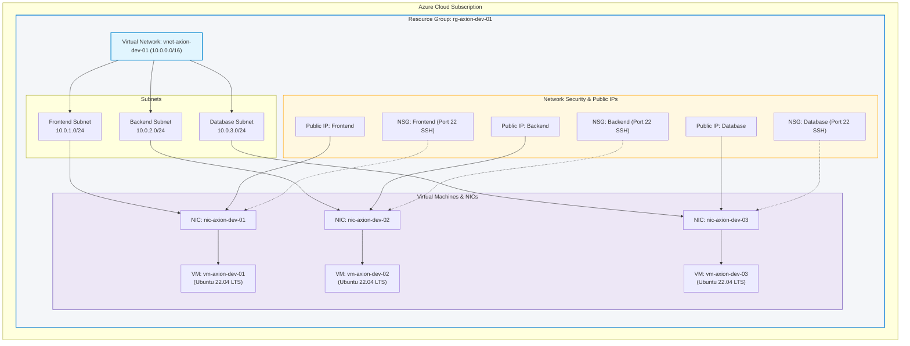

# 🚀 Azure Multi-Tier Infrastructure with Terraform (`terraform-axion-infra`)

[](https://www.terraform.io/)
[](https://registry.terraform.io/providers/hashicorp/azurerm/latest)
[](#-architecture-overview)
[](LICENSE)

A production-ready, modular **Infrastructure as Code (IaC)** repository built with **Terraform** to provision scalable multi-tier infrastructure (Frontend, Backend, and Database) on **Microsoft Azure**.

---

## 📌 Table of Contents

- [Overview](#-overview)
- [Architecture Overview](#-architecture-overview)
- [Repository Structure](#-repository-structure)
- [Modules Breakdown](#-modules-breakdown)
- [Prerequisites](#-prerequisites)
- [Quick Start Guide](#-quick-start-guide)
  - [1. Authenticate with Azure](#1-authenticate-with-azure)
  - [2. Configure Variables](#2-configure-variables)
  - [3. Deploy Infrastructure](#3-deploy-infrastructure)
  - [4. Verify Deployment](#4-verify-deployment)
  - [5. Cleanup / Teardown](#5-cleanup--teardown)
- [Security & Best Practices](#-security--best-practices)
- [Author & Acknowledgements](#-author--acknowledgements)

---

## 🌟 Overview

This repository automates the provisioning of complete end-to-end cloud infrastructure on Microsoft Azure. It uses a **data-driven, decoupled module architecture** with Terraform maps (`for_each`) to provision multiple environments (`dev`, `prod`) cleanly without code duplication.

### Key Highlights
- **100% Modular Design**: Independent, reusable modules under `/modules` for each Azure component.
- **Multi-Environment Support**: Clean separation between environments under `/environment/` (`dev`, `prod`).
- **Dynamic Resource Creation**: Leverages `for_each` over map variables for single-point configuration via `terraform.tfvars`.
- **Decoupled Linking via Data Sources**: Modules use AzureRM `data` blocks to resolve resource dependencies cleanly without tightly coupling module outputs.
- **3-Tier Topology Ready**: Pre-configured for Frontend, Backend, and Database tiers across isolated subnets, network security groups, and virtual machines.

---

## 🏗️ Architecture Overview

The following diagram illustrates the flow and relationship between the provisioned Azure components:



---

## 📁 Repository Structure

```plaintext
terraform-axion-infra/
│
├── .gitignore                                # Git ignore file for Terraform state, secrets, and temp files
├── README.md                                 # Project documentation
│
├── environment/                              # Environment-specific root modules
│   ├── dev/                                  # Development Environment
│   │   ├── main.tf                           # Module invocations & dependency orchestration
│   │   ├── provider.tf                       # Terraform & AzureRM provider configuration
│   │   ├── variables.tf                      # Variable declarations for dev
│   │   └── terraform.tfvars                  # Concrete parameter values for dev deployment
│   │
│   └── prod/                                 # Production Environment
│       └── main.tf                           # Module invocations for production
│
└── modules/                                  # Reusable Terraform Child Modules
    ├── azurerm_resource_group/               # Azure Resource Group module
    │   ├── main.tf
    │   └── variables.tf
    │
    ├── azurerm_virtual_network/              # Azure Virtual Network (VNet) module
    │   ├── main.tf
    │   └── variables.tf
    │
    ├── azurerm_subnet/                       # Subnet creation module
    │   ├── main.tf
    │   └── variables.tf
    │
    ├── azurerm_public_ips/                   # Public IP allocation module
    │   ├── main.tf
    │   └── variables.tf
    │
    ├── azurerm_network_interface_card/       # Network Interface Card (NIC) module
    │   ├── main.tf
    │   ├── data.tf                           # Data lookups for Subnets & PIPs
    │   └── variables.tf
    │
    ├── azurerm_network_security_group/       # NSG & NIC association module
    │   ├── main.tf
    │   ├── data.tf                           # Data lookup for target NICs
    │   └── variables.tf
    │
    └── azurerm_virtual_machine/              # Linux Virtual Machine provisioner
        ├── main.tf
        ├── data.tf                           # Data lookup for target NICs
        └── variables.tf
```

---

## 🧩 Modules Breakdown

| Module | Directory | Purpose | Key Attributes Configured |
| :--- | :--- | :--- | :--- |
| **Resource Group** | `modules/azurerm_resource_group` | Manages Azure Resource Groups lifecycle | `name`, `location` |
| **Virtual Network** | `modules/azurerm_virtual_network` | Provisions software-defined VNet | `name`, `location`, `address_space` |
| **Subnet** | `modules/azurerm_subnet` | Creates segmented subnets inside VNet | `name`, `address_prefixes`, `vnet_name` |
| **Public IP** | `modules/azurerm_public_ips` | Provisions static/dynamic external IPs | `name`, `allocation_method`, `sku` |
| **Network Interface** | `modules/azurerm_network_interface_card` | Creates NICs & attaches Subnet + PIP | `name`, `ip_configuration`, Subnet/PIP binding |
| **NSG** | `modules/azurerm_network_security_group` | Creates Security Rules & associates to NIC | SSH Port `22` rule, NIC Association |
| **Virtual Machine** | `modules/azurerm_virtual_machine` | Provisions Ubuntu Linux Virtual Machines | OS disk, Image Publisher/Offer/SKU, OS Profile |

---

## ⚙️ Prerequisites

Before you begin, ensure you have installed and configured:

1. **[Terraform CLI](https://developer.hashicorp.com/terraform/install)** (v1.5.0 or higher recommended).
2. **[Azure CLI](https://learn.microsoft.com/en-us/cli/azure/install-azure-cli)** (`az`).
3. An active **Microsoft Azure Subscription** with Contributor or Owner access.

---

## 🚀 Quick Start Guide

### 1. Authenticate with Azure

Login to your Azure account using Azure CLI:

```bash
az login
```

If you have multiple subscriptions, select the appropriate subscription:

```bash
az account set --subscription "<YOUR_SUBSCRIPTION_ID_OR_NAME>"
```

Verify your active subscription:

```bash
az account show --output table
```

---

### 2. Configure Variables

Navigate to the desired environment directory (e.g., `environment/dev`):

```bash
cd environment/dev
```

Inspect and update `terraform.tfvars` if needed (e.g., change regions, VM sizes, username, or credentials):

```hcl
rgs = {
  rg1 = {
    name     = "rg-axion-dev-01"
    location = "Central India"
  }
}
```

> ⚠️ **Important Security Note**: Avoid committing real passwords in `terraform.tfvars`. Use environment variables (`TF_VAR_...`) or Azure Key Vault for sensitive credentials in production.

---

### 3. Deploy Infrastructure

Run the standard Terraform workflow:

#### A. Initialize Terraform
Downloads the required provider plugins (`hashicorp/azurerm`) and registers child modules:

```bash
terraform init
```

#### B. Validate Configuration
Checks your configuration files for syntax and internal consistency:

```bash
terraform validate
```

#### C. Preview the Execution Plan
Review the proposed changes before applying:

```bash
terraform plan
```

#### D. Apply Changes
Provision the resources in Azure:

```bash
terraform apply
```
*(Type `yes` when prompted to confirm).*

---

### 4. Verify Deployment

Once `terraform apply` finishes successfully:

1. **Check Azure Portal**:
   - Navigate to the resource group `rg-axion-dev-01`.
   - Verify that VNet, Subnets, Public IPs, NICs, NSGs, and VMs are active.

2. **Test SSH Connectivity**:
   Find the Public IP assigned to your VM (e.g. `pip-axion-dev-01`) and connect:

   ```bash
   ssh <admin_username>@<PUBLIC_IP_ADDRESS>
   ```

---

### 5. Cleanup / Teardown

To destroy all provisioned infrastructure and prevent ongoing cloud charges:

```bash
terraform destroy
```
*(Type `yes` when prompted to confirm).*

---

## 🛡️ Security & Best Practices

1. **Remote State Backend**:
   - For team workflows and production environments, configure remote state storage using **Azure Blob Storage** (`azurerm` backend) with state locking via Azure Blob lease.
2. **Secrets Management**:
   - Do not commit sensitive passwords to Git.
   - Utilize SSH Public Keys (`admin_ssh_key`) instead of password authentication for Linux VMs.
   - Integrate with **Azure Key Vault** for credentials.
3. **Network Hardening**:
   - Restrict NSG rule `source_address_prefix` to trusted IPs instead of open wildcard `*` for SSH port 22.
4. **Git Hygiene**:
   - Ensure `terraform.tfvars`, `*.tfstate`, and `.terraform/` directories are kept in `.gitignore`.

---

## 👤 Author & Acknowledgements

- **Repository**: [Sudhanshu4352/terraform-axion-infra](https://github.com/Sudhanshu4352/terraform-axion-infra)
- Built with ❤️ for automated, clean, and scalable Cloud Infrastructure on Azure.
